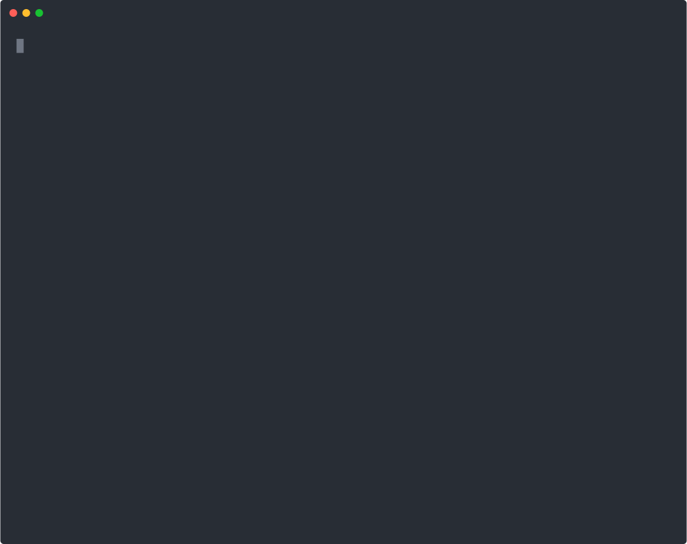

# Regula

**EU AI Act risk scanner for code.**

[](https://pypi.org/project/regula-ai/)
[](LICENSE.txt)
[](https://python.org)
[](https://github.com/kuzivaai/getregula/actions)
[](#verified-numbers)
[](docs/accessibility/README.md)

---

## Table of contents

- [What it does](#what-it-does)
- [Quick start](#quick-start)
- [What Regula tells you](#what-regula-tells-you)
- [Key commands](#key-commands)
- [Who is this for?](#who-is-this-for)
- [What Regula is (and isn't)](#what-regula-is-and-isnt)
- [Bias evaluation — methodology and ethics](#bias-evaluation--methodology-and-ethics)
- [Important limitations](#important-limitations)
- [Verified numbers](#verified-numbers)
- [Contributing](#contributing)
- [Licence](#licence)

---



---

## What it does

If you ship an AI product to EU users, the EU AI Act applies to you -- regardless of where you are based or how small your team is. Regula scans your codebase for risk indicators, classifies your system into one of the Act's four risk tiers, and tells you which obligations apply. It runs in your terminal, in CI/CD, or as a pre-commit hook. No external dependencies, no API calls, no data leaves your machine.

## Quick start

```bash
pipx install regula-ai      # or: pip install regula-ai / uv pip install regula-ai
```

**Not sure if the AI Act applies?** No code needed:
```bash
regula assess               # 5 yes/no questions → your risk tier
```

**Want to scan your code?**
```bash
regula check .              # 404 patterns, 8 languages, 30 seconds
```

**Need documentation for auditors?**
```bash
regula evidence-pack --sign .   # signed, timestamped, SHA-256 verified
```

**Just want to see it work?**
```bash
regula demo                 # scan a bundled example project
```

### Install details

The recommended install is **pipx** — it isolates Regula from your system Python and avoids the `externally-managed-environment` error on Ubuntu 22.04+, Debian 12+, Fedora, Arch, and Homebrew Python.

If you don't have pipx yet, install it first (one-time):

| Platform | Install pipx |
|---|---|
| macOS | `brew install pipx && pipx ensurepath` |
| Debian / Ubuntu | `sudo apt install pipx && pipx ensurepath` |
| Fedora | `sudo dnf install pipx && pipx ensurepath` |
| Arch | `sudo pacman -S python-pipx && pipx ensurepath` |
| Windows | `python -m pip install --user pipx && python -m pipx ensurepath` |

**Already using uv?** `uvx --from regula-ai regula` runs it with no install step (the `--from` flag is required because the PyPI package name `regula-ai` differs from the CLI name `regula`). Or install it permanently with `uv tool install regula-ai`.

**Running inside a venv or conda env?** `pip install regula-ai` works fine there — the PEP 668 restriction only applies to system Python.

See [`docs/installation.md`](docs/installation.md) for troubleshooting (`externally-managed-environment`, `command not found: regula` after install, PATH setup per shell).

### Try it against a known high-risk fixture:

```bash
regula check examples/cv-screening-app
```

See [`examples/`](examples/) for runnable reference projects covering each EU AI Act risk tier, or walk through the full 10-minute evaluation journey in [`examples/cv-screening-app/`](examples/cv-screening-app/) — install, scan, plan, gap, conform, verify, handoff to red-team tooling.

For a deeper first-time-user walk-through (policy tuning, CI integration, baselining) see [`docs/QUICKSTART.md`](docs/QUICKSTART.md).

### CI/CD

```yaml
# .github/workflows/regula.yaml
name: AI Governance Check
on: [push, pull_request]
jobs:
  regula:
    runs-on: ubuntu-latest
    steps:
      - uses: actions/checkout@v4
      - uses: kuzivaai/getregula@v1
        with:
          path: '.'
          upload-sarif: 'true'
          fail-on-prohibited: 'true'
```

## What Regula tells you

The EU AI Act defines four risk tiers. Regula maps code patterns to each:

| Tier | Action | What it means |
|------|--------|---------------|
| **Prohibited** (Article 5) | Block | Social scoring, subliminal manipulation, real-time biometric ID, emotion detection in workplaces. Regula blocks these patterns and explains the specific prohibition. |
| **High-risk** (Annex III) | Warn + requirements | CV screening, credit scoring, healthcare services, biometrics, education assessment. Regula lists the Articles 9-15 obligations that apply if the system is confirmed high-risk. |
| **Limited-risk** (Article 50) | Transparency note | Chatbots, deepfakes, emotion recognition. Regula flags the transparency disclosure required. |
| **Minimal-risk** | Log only | Spam filters, recommendations, code completion. Logged for awareness, no action required. |

Every finding includes the relevant Article reference and explains when exceptions may apply. Regula flags patterns -- it does not make legal determinations.

## Key commands

| Command | What it does |
|---------|-------------|
| `regula` | Scan current directory, show compliance score and next steps |
| `regula check .` | Detailed risk scan with per-file findings |
| `regula comply` | EU AI Act obligation checklist with completion status |
| `regula gap --project .` | Compliance gap assessment against Articles 9-15 |
| `regula plan --project .` | Prioritised remediation plan based on gap results |
| `regula fix --project .` | Generate compliance fix scaffolds for findings |
| `regula evidence-pack --project .` | Auditor-ready evidence package |
| `regula conform --project .` | Article 43 conformity assessment evidence pack |
| `regula check --ci .` | CI mode -- exit code 1 on any WARN or BLOCK finding, SARIF output |
| `regula assess` | Interactive applicability check -- does the EU AI Act apply to you? |
| `regula demo` | Scan a bundled example project -- zero-commitment trial |
| `regula api-server` | Start the REST API (localhost:8487) with web dashboard |
| `regula conform --organisational` | Governance self-assessment for Articles 9/17/27/72 |

Regula has 61 commands in total. Run `regula --help-all` for the full list, or see [`docs/cli-reference.md`](docs/cli-reference.md).

### REST API and web dashboard

For GRC integration or non-terminal users:

```bash
python3 scripts/api_server.py --port 8487
# Open http://localhost:8487/v1/dashboard
```

Seven endpoints: `/health`, `/v1/check`, `/v1/classify`, `/v1/gap`, `/v1/questionnaire`, `/v1/questionnaire/evaluate`, `/v1/dashboard`. All return the same JSON envelope as the CLI. No auth -- run behind a reverse proxy for remote access.

## Who is this for?

- **Solo founders and indie hackers** building AI products (with Claude Code, Cursor, or similar) who have EU users and need to know what the EU AI Act means for their code.
- **Small teams** who want to understand their compliance exposure before it becomes a sales blocker. Enterprise procurement is already asking for AI Act evidence.
- **Engineering teams** who want EU AI Act scanning in CI/CD to catch high-risk or prohibited patterns before they ship.

## What Regula is (and isn't)

**Regula is:**

- A development-time static analysis tool that detects AI-related code patterns and maps them to EU AI Act obligations
- A shift-left compliance scanner -- like ESLint for regulatory risk, running in your terminal or CI/CD pipeline
- A starting point for compliance awareness, not a finish line

**Regula is not:**

- A runtime monitoring system (it analyses source code, not running systems)
- A legal compliance certificate (findings are indicators, not legal determinations)
- A replacement for enterprise GRC platforms like Credo AI or Holistic AI (it complements them)
- A production fairness testing platform (`regula bias` runs benchmark probes against a local model as a starting point, but does not replace runtime fairness monitoring)
- Legal advice (consult qualified legal counsel for compliance decisions)

Regula helps development teams understand their EU AI Act exposure early. It does not replace the organisational, procedural, and legal work required for full compliance. For a detailed account of what falls outside Regula's scope, see [`docs/what-regula-does-not-do.md`](docs/what-regula-does-not-do.md), and for Regula's own model card (intended use, training data, evaluation, known failure modes) see [`docs/MODEL_CARD.md`](docs/MODEL_CARD.md).

## Bias evaluation — methodology and ethics

`regula bias` runs two social-bias benchmarks against a locally-hosted
language model (Ollama, `llama3.2`/`mistral`/`qwen` variants supported)
as evidence for EU AI Act Article 10 data-governance documentation.

| Benchmark | Paper | Method | What it measures |
|---|---|---|---|
| CrowS-Pairs | Nangia et al., 2020 | Log-probability difference between stereotypical and anti-stereotypical sentence pairs | Intrinsic bias in masked/causal LM output |
| BBQ | Parrish et al., 2022 | Question-answering on ambiguous-context prompts | Bias surfacing in downstream QA behaviour |

Both include Wilson confidence intervals for small-sample reliability and
bootstrap CIs for distribution estimates. Full methodology lives in
[`scripts/bias_eval.py`](scripts/bias_eval.py) and
[`docs/benchmarks/PRECISION_RECALL_2026_04.md`](docs/benchmarks/PRECISION_RECALL_2026_04.md).

**Ethics statement.** CrowS-Pairs and BBQ stereotype pairs are used
**solely for scientific evaluation** of model behaviour under controlled
conditions. Regula does **not display individual stereotype pairs** in
terminal output or reports — only aggregated scores, confidence
intervals, and benchmark-level verdicts. The pairs are distributed under
the dataset's own licence (CC BY-SA 4.0 for CrowS-Pairs) and are not
redistributed or modified by Regula. Opinions encoded in the stereotype
pairs do not reflect the views of the maintainer, Regula contributors,
or any user running the tool; their presence is instrumental, not
endorsing. `regula bias` is a development-time starting point for bias
documentation, not a production fairness monitor — see "What Regula is
(and isn't)" above.

## Important limitations

Regula performs **pattern-based risk indication**, not legal risk classification.

- The EU AI Act classifies risk based on intended purpose and deployment context (Article 6), not code patterns. Regula's findings are indicators that warrant human review.
- **False positives will occur.** Blind-labelled benchmark on 50 randomly selected Python AI repos measured **81.4% precision on production code** (N=118, default `--skip-tests` settings). Per-tier: `ai_security` (85%), `agent_autonomy` (83%), `limited_risk` (88%), `minimal_risk` (100%). The `high_risk` tier (22%) remains weakest — domain keyword findings now require `--domain` declaration or import fingerprinting (v1.7.0+). Full methodology, corpus selection, and reproduction steps: [`benchmarks/README.md`](benchmarks/README.md).
- **False negatives will occur.** Novel risk patterns not in the database will be missed.
- Article 5 prohibitions have conditions and exceptions that require human judgment.
- The audit trail is self-attesting (locally verifiable, not externally witnessed).
- This is not a substitute for legal advice or DPO review.

## Verified numbers

| What | Count |
|------|------:|
| CLI commands | 61 |
| Risk detection patterns (regexes) | 404 |
| Language families scanned | 8 (Python, JS, TS, Java, Go, Rust, C/C++, Jupyter) |
| Compliance frameworks mapped | 12 |
| Tests (pytest --collect-only, all passing) | 1223 |
| Required production dependencies | 0 |

For buyer-facing trust evidence (every number above paired with a reproducible command, plus precision/recall benchmark, security posture, and audit trail), see [`docs/TRUST.md`](docs/TRUST.md).

## Contributing

Bug reports and pull requests are welcome.

- Run `pytest tests/ -q` before opening a PR.
- Pattern additions go in `scripts/classify_risk.py`. Each pattern should have a corresponding test.
- Regula is intentionally risk *indication*, not legal classification. New patterns should be conservative -- false positives erode trust more than false negatives for a developer tool.
- See [`CONTRIBUTING.md`](CONTRIBUTING.md) for the full contributor guide and [`CHANGELOG.md`](CHANGELOG.md) for version history.

### Authorship

Regula is maintained by Kuziva Muzondo (solo). Commits include a `Co-Authored-By: Claude Opus 4.6` trailer where the work was paired with Anthropic's Claude. This is standard pair-programming attribution — the maintainer is accountable for every merged change, and every commit was reviewed and reasoned about by a human before landing. Said plainly so you know how the sausage is made.

## Licence

**Engine and CLI:** [Apache License 2.0](LICENSE.txt) **OR** [European Union Public Licence v. 1.2](LICENSE.EUPL) — at your option. Pick the one that fits your context:

- **Apache 2.0** includes an explicit patent grant, making it the preferred choice for enterprise adoption, commercial redistribution, and any context where patent clarity matters.
- **EUPL-1.2** is explicitly recognised inside EU institutions and public-sector procurement, is strongly-copyleft on software, and has a formal compatibility appendix (GPL v2/v3, AGPL v3, OSL, EPL, CeCILL, MPL 2.0, LGPL, CC BY-SA 3.0) for downstream projects. If you work with a European public administration, EUPL is often the required or preferred licence.

You may choose either licence for any use. You do not need to state which one you picked, but attribution (keep the copyright notice and NOTICE file) is required under both.

**Risk patterns and regulatory data:** [Detection Rule License (DRL) 1.1](docs/LICENSE.Detection.Rules.md). You may use, modify, and redistribute the patterns freely. Attribution is required if you redistribute the patterns or use them in a product. If your tool generates match output from these patterns, the output must credit the source.

The SPDX expression for the full package is `(Apache-2.0 OR EUPL-1.2) AND LicenseRef-DRL-1.1`.
